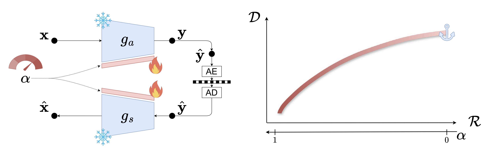
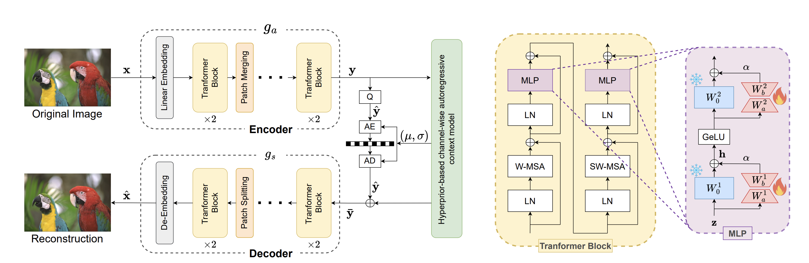
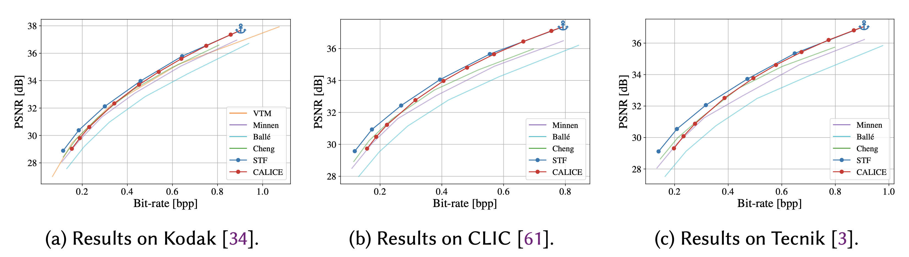
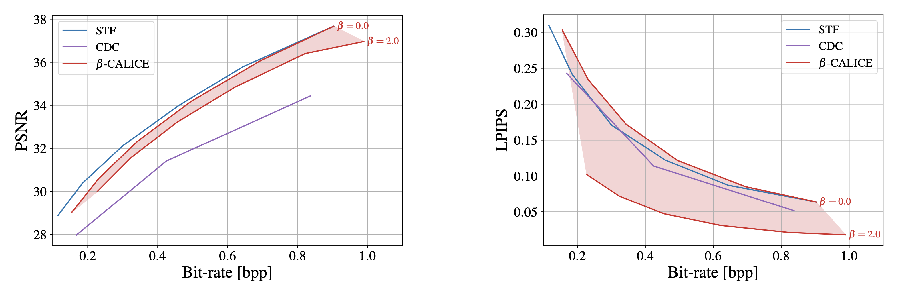
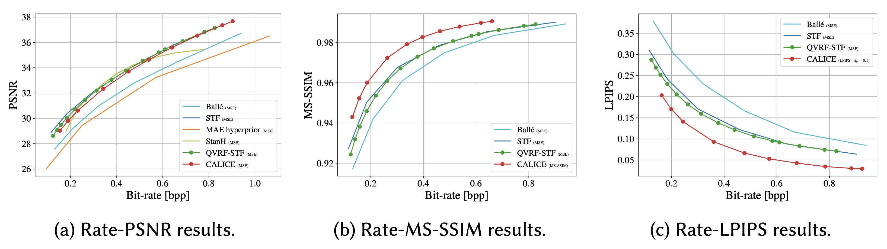

# CALICE: Continuous bitrate control with Adapted LIC modEl

<div align="center">

</div>
<div align="center">
<b>Authors:</b> Gabriele Spadaro<sup>1,2</sup>, Alberto Presta<sup>1</sup>, Jhony H. Giraldo<sup>2</sup>, Attilio Fiandrotti<sup>1,2</sup>, Marco Grangetto<sup>1</sup> and Enzo Tartaglione<sup>2</sup>

<sup>1</sup>University of Turin, Italy<br>
<sup>2</sup>LTCI, Télécom Paris, Institut Polytechnique de Paris
</div>

## 📢 Announcement 
<div style="text-align: justify;">
Official pytorch implementation of the paper "<strong>CALICE: Continuous bitrate control with Adapted LIC modEl</strong>", published at <strong>ACM Transactions on Multimedia Computing, Communications, and Applications</strong>. 
<br><br>
  <a href="https://dl.acm.org/doi/abs/10.1145/3820658">
    📄 Read the Journal Paper
  </a>
</div>


## Abstract
Learned image compression (LIC) has drawn much attention recently as it outperforms standardized codecs
in rate-distortion (RD) efficiency. However, a LIC model is typically trained for a specific RD trade-off, and achieving a different target rate requires retraining the model and storing the weights as a whole, limiting the practical applicability of LIC. In this paper, we introduce CALICE, a framework for achieving continuous bitrate control by plugging into a pre-trained LIC model a set of modular adapters. Unlike similar methods that require a distinct set of adapters for each target rate, our method achieves continuous bitrate control by modulating a single set of adapters via a scalar parameter 𝜶, with a total overhead of less than 0.35% of the parameters of the LIC model. This design enables efficient support for multiple distortion objectives by learning lightweight, distortion-aware adapters. We also extend our strategy beyond rate control, demonstrating its ability to provide fine-grained adaptation of perceptual quality along the distortion-perception trade-off. To our knowledge, this is the first method that jointly addresses rate and perceptual control using a unified, low-cost strategy.


<div align="center">

</div>


## Trained Models

We release the pretrained anchor models and the CALICE variable-rate checkpoints used in the paper.

Results on Kodak are provided in JSON format in the [`./assets`](./assets) folder.

All pretrained models can also be found in this [Google Drive folder](https://drive.google.com/drive/folders/1NEDY7TcFWy_LuUr3jIDuHBcW4LHBYqXx?usp=drive_link).

| Model family | Objective / setting | Checkpoint |
|---|---|---|
| STF anchor | Fixed-rate anchor model | [Download](https://drive.google.com/file/d/1Tj-xWSngX1P1Pg3cPPk74XpIcTcVOQkP/view?usp=sharing) |
| TCM anchor | Fixed-rate anchor model | [Download](https://drive.google.com/file/d/1KllicXKrzzhaFL73597CYeqrDMs78WXP/view?usp=sharing) |
| CALICE-STF | Variable rate, MSE-optimized | [Download](https://drive.google.com/file/d/1yelw1NKArXzNqO8VWclCN7vy_e-bR3P4/view?usp=sharing) |
| CALICE-STF | Variable rate, MS-SSIM-optimized | [Download](https://drive.google.com/file/d/10cGB9oJUo3765POWomOWZhSVkE7iMTib/view?usp=sharing) |
| CALICE-STF | Variable rate, LPIPS-optimized | [Download](https://drive.google.com/file/d/1ir0Hzhyig2riJHe6WKELPBskc0aa7AsN/view?usp=sharing) |
| β-CALICE-STF | Variable rate-distortion-perception | [Download](https://drive.google.com/file/d/1gBVKXQpoJJg5nCo3pTcxsBclBCvevpHB/view?usp=sharing) |
| CALICE-TCM | Variable rate, MSE-optimized | [Download](https://drive.google.com/file/d/1aBQNKzM_GQ21y4XOHn74NaG6R-iAAXbw/view?usp=sharing) |
| CALICE-Cheng | Variable rate, MSE-optimized | [Download](https://drive.google.com/file/d/1lJSTOlQhx9IiB4T40jWKIbMB2pCQtVE0/view?usp=sharing) |

## Dataset

For training, we follow the data preparation protocol used in the [QRAF repository](https://github.com/bytedance/QRAF).

The training set is built by selecting:

- the largest 8000 images from [ImageNet](http://www.image-net.org/challenges/LSVRC/2012/dd31405981ef5f776aa17412e1f0c112/ILSVRC2012_img_train.tar);
- 584 images from [CLIC2020](https://data.vision.ee.ethz.ch/cvl/clic/professional_train_2020.zip).


## Environment

To build the running environment, please refer to the provided [`Dockerfile`](Dockerfile).

## Usage overview

This repository supports three main experimental settings:

| Setting | Goal | Main section |
|---|---|---|
| Variable rate-distortion | Control bitrate continuously with one set of adapters | [Variable Rate-Distortion Model](#variable-rate-distortion-model) |
| Variable rate-distortion-perception | Control both bitrate and perceptual realism | [Variable Rate-Distortion-Perception Model](#variable-rate-distortion-perception-model) |
| Distortion-aware variable rate | Train variable-rate adapters for different quality metrics, such as MS-SSIM or LPIPS | [Distortion-aware Variable Rate Model](#distortion-aware-variable-rate-model) |

# Variable Rate-Distortion Model 

This setting corresponds to the main CALICE variable-rate model. Starting from a fixed-rate anchor model, CALICE plugs lightweight modular adapters into the encoder and decoder. At inference time, the bitrate is controlled by changing the adapter scaling parameter α, without retraining the full model or switching between multiple checkpoints.


<div align="center">

</div>


## Evaluate
The following command evaluates a **CALICE-STF** variable-rate model on Kodak. It compresses the test images at multiple α values and saves the resulting rate-distortion measurements in the selected output folder.

```bash
python -m evaluate.eval_continuous \
--test-dir /scratch/dataset/kodak/ \
--save-path res_vr_stf \
--model stf \
--ckpt ../checkpoints/results/stf/mse/checkpoint.pth.tar \
--label CALICE-STF \ 
--adapter-config ../configs/stf_8_8_all.yaml
```

To evaluate **CALICE-TCM**, use the same command and change:

```bash
- --save-path res_vr_tcm
- --model tcm
- --ckpt ../checkpoints/results/tcm/mse/checkpoint.pth.tar
- --label CALICE-TCM
- --adapter-config ../configs/tcm_8_1_all.yaml
```

To evaluate **CALICE-Cheng**, use the same command and change:

```bash
- --save-path res_vr_cheng
- --model cheng-attn
- --ckpt ../checkpoints/results/cheng_attn/mse/checkpoint.pth.tar
- --label CALICE-Cheng
- --adapter-config ../configs/cheng_8_1_all.yaml
```

## Training 

The following commands train the modular adapters used to obtain continuous variable-rate behavior. The backbone model is initialized from a fixed-rate checkpoint and kept mostly frozen, while the adapters are optimized to cover a range of rate-distortion trade-offs.


### STF

This command trains LoRA-based adapters on top of the STF anchor model.

```bash
python train.py \
--checkpoint ../checkpoints/anchors/stf_0483_best.pth.tar \
--dataset /home/ids/gspadaro/data/dataset/qvrf_dataset/ \
--test-dir /home/ids/gspadaro/data/kodak/ \
--epochs 500 \
--learning-rate 0.00001 \
--mixed-adapt 0 --lora 1 --conv-adapt 0 \
--adapter-config ../configs/stf_8_8_all.yaml \
--adapter-opt adam \
--adapter-sched cosine \
--model stf \
--lambda 0.0018,0.0483 \
--save 1 \
--save-dir results/stf/mse/variable_stf
```

### TCM

This command trains the CALICE adapters for the TCM backbone.

```bash
python train.py \
--checkpoint ../checkpoints/anchors/tcm_0.05.pth.tar \
--dataset /home/ids/gspadaro/data/dataset/qvrf_dataset/ \
--test-dir /home/ids/gspadaro/data/kodak/ \
--epochs 500 \
--learning-rate 0.0001 \
--mixed-adapt 1 --conv-adapt 0 --lora 0 \
--adapter-config ../configs/tcm_8_1_all.yaml \
--adapter-opt adam \ 
--adapter-sched cosine \
--model tcm \
--lambda 0.0025,0.05 \
--save 1 \
--save-dir results/tcm/mse/variable_tcm 
```

### Cheng

This command trains convolutional adapters for the Cheng attention model. In this case, the model is loaded from the CompressAI checkpoint.

```bash
python train.py \
--dataset /home/ids/gspadaro/data/dataset/qvrf_dataset/ \
--test-dir /home/ids/gspadaro/data/kodak/ \
--epochs 500 \
--learning-rate 0.0001 \
--mixed-adapt 0 --conv-adapt 1 --lora 0 \
--adapter-config ../configs/cheng_8_1_all.yaml \
--adapter-opt adam \
--adapter-sched cosine \
--model cheng-attn \
--lambda 0.0018,0.0483 \
--compressai-checkpoint 1 \
--compress-often 0 \
--save 1 \
--save-dir results/cheng_attn/mse/variable_cheng
```


# Variable Rate-Distortion-Perception Model

This setting extends the variable-rate CALICE model to also control the perceptual realism of the reconstructed image. Starting from a variable rate-distortion model, a second set of modular adapters is trained to move along the distortion-perception trade-off. This allows the model to prioritize either accurate reconstruction or perceptual quality at inference time.

<div align="center">

</div>

## Evaluate

The following command evaluates the variable rate-distortion-perception model on Kodak. The first adapter configuration controls the variable-rate model, while the second adapter configuration controls the perceptual adaptation.

```bash
python -m evaluate.eval_continuous_rdp --test-dir /scratch/dataset/kodak/ --save-path ../check_repo/test_rdp_stf --model stf --ckpt ../checkpoints/results/stf/rdp/_checkpoint.pth.tar --label beta-CALICE (STF) --adapter-config ../configs/stf_8_8_all.yaml --adapter-adapter-config ../configs/adapt_stf_8_8_all.yaml
```

## Training
The following command starts from a pretrained CALICE variable-rate STF model and trains an additional set of modular adapters for perceptual control.

```bash
python train_perception.py \
--checkpoint results/stf/mse/variable_stf_seed_42/checkpoint.pth.tar \
--dataset /home/ids/gspadaro/data/dataset/qvrf_dataset/ \
--test-dir /home/ids/gspadaro/data/kodak/ \
--epochs 500 \
--learning-rate 0.00001 \
--adapter-config ../configs/stf_8_8_all.yaml \
--adapter-adapter-config ../configs/adapt_stf_8_8_all.yaml \
--adapter-opt adam \
--adapter-sched cosine \
--model stf \
--loss-type rdp \
--lambda 0.048,1.28 \
--save 1 \
--save-dir results/stf/rdp/variable_rdp_stf 
```


# Distortion-aware variable rate model

This setting trains CALICE adapters for different distortion objectives. Instead of optimizing only for MSE/PSNR, the model can be adapted to other quality metrics, such as MS-SSIM or LPIPS, while still preserving variable-rate control.


<div align="center">

</div>

## Evaluate
The following command evaluates the MS-SSIM-optimized CALICE-STF model on Kodak.

```bash
python -m evaluate.eval_continuous --test-dir /scratch/dataset/kodak/ --save-path res_vr_stf_mssim --model stf --ckpt ../checkpoints/results/stf/mssim/checkpoint.pth.tar --label CALICE-STF-MSSIM --adapter-config ../configs/stf_8_8_all.yaml
```

To evaluate the LPIPS-optimized model, use the same command and change:

```bash
- --save-path res_vr_stf_lpips
- --ckpt ../checkpoints/results/stf/lpips_01/checkpoint.pth.tar
- --label CALICE-STF-LPIPS
```

## Training
Training a distortion-aware variable-rate model is done in two steps.

### Step 1: adapt the anchor model to the target distortion metric

First, we train a set of adapters to adapt the fixed-rate STF anchor model to a new distortion objective, such as MS-SSIM.

```bash
python train.py \
--checkpoint ../checkpoints/anchors/stf_0483_best.pth.tar \
--dataset /home/ids/gspadaro/data/dataset/qvrf_dataset/ \
--test-dir /home/ids/gspadaro/data/kodak/ \
--epochs 500 \
--learning-rate 0.00001 \
--mixed-adapt 0 --lora 1 --conv-adapt 0 \
--adapter-config ../configs/stf_8_8_all.yaml \ 
--adapter-opt adam \
--adapter-sched cosine \
--model stf \
--fixed-lmbda 60.50 --loss-type ms-ssim \
--save 1 \
--save-dir results/sft/mssim/1st_step
```

for LPIPS, change:
```bash
- --fixed-lmbda 0.048 
- --loss-type lpips 
- --lmbda-percpetion 0.1
```


### Step 2: train variable-rate adapters for the new distortion metric

Then, starting from the adapted checkpoint, we train a second set of modular adapters to obtain variable-rate behavior with respect to the selected distortion metric.

```bash
python train.py \
--checkpoint results/sft/mssim/1st_step_seed_42/checkpoint.pth.tar \
--adapted-checkpoint 1 \
--adapter-checkpoint-config ../configs/stf_8_8_all.yaml \
--dataset /home/ids/gspadaro/data/dataset/qvrf_dataset/ \
--test-dir /home/ids/gspadaro/data/kodak/ \
--epochs 500 \
--learning-rate 0.00001 \
--mixed-adapt 0 --lora 1 --conv-adapt 0 \ 
--adapter-config ../configs/stf_8_8_all.yaml \
--adapter-opt adam \
--adapter-sched cosine \
--model stf \
--lambda 2.40,60.50 \
--loss-type ms-ssim \
--save 1 \
--save-dir results/sft/mssim/2st_step
```

for LPIPS, change:
```bash
- --checkpoint /path/to/anchor/lpips
- --lambda 0.048,1.28 
- --inverse-lmbda 1 
- --loss-type lpips 
- --lmbda-percpetion 0.1
```


## Acknowledgments
This work was supported by the French National Research Agency (ANR) in the framework of the IA Clusterproject “Hi! PARIS Cluster 2030” under Grant ANR-23-IACL-005, and by the Hi! PARIS Center on Data Analyticsand Artificial Intelligence. This work was also supported by the DARE SGA1 project, which has received fundingfrom the European High-Performance Computing Joint Undertaking (JU) under grant agreement No. 101202459.


This repository is based on [CompressAI](https://github.com/interdigitalinc/compressai).

# Citation
If you use our code, please cite

```
@article{spadaro_calice,
    author = {Spadaro, Gabriele and Presta, Alberto and Giraldo, Jhony H. and Fiandrotti, Attilio and Grangetto, Marco and Tartaglione, Enzo},
    title = {CALICE: Continuous bitrate control with Adapted LIC modEl},
    year = {2026},
    publisher = {Association for Computing Machinery},
    address = {New York, NY, USA},
    issn = {1551-6857},
    url = {https://doi.org/10.1145/3820658},
    doi = {10.1145/3820658},
    journal = {ACM Trans. Multimedia Comput. Commun. Appl.}
}

```